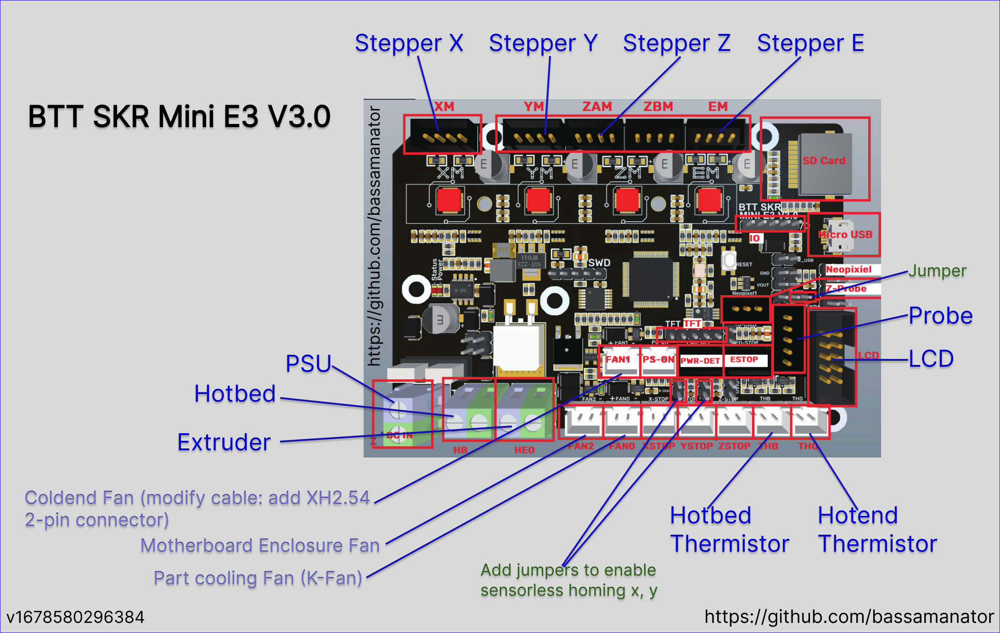

# 🚨 *One-Stop-Shop* Sovol SV06 Klipper Configuration

This branch contains the Klipper configuration and firmware for the **Sovol SV06** 3D printer with the **BTT SKR-Mini-E3-V3.0** motherboard.

If you were looking for my OSS Klipper Configuration for the **Sovol SV06** with *completely stock hardware*, please refer to the [master](https://github.com/bassamanator/Sovol-SV06-firmware/tree/master) branch.

If you wanted to use the One-Stop-Shop Klipper Configuration for a different printer, please switch to the [any-printer](https://github.com/bassamanator/Sovol-SV06-firmware/tree/any-printer) branch.

I am creating these files for my personal use and cannot be held responsible for what it might do to your printer. Use at your own risk.

⚠️ I am only 99% confident that this branch is production ready. Proceed with caution.

🙏🏻🙌🏻 A big thanks to [transistor1](https://github.com/transistor1) for getting this `printer.cfg` up an running to begin with.

## Installation Instructions

### Electronic Wiring

Wire cables according to the following diagram:

### Download Firmware Precompiled by BIGTREETECH

💡 The firmware files are located in `misc/skr-mini`.
💡 Be sure to download the `raw` files. Find out more about this [here](https://stackoverflow.com/questions/4604663/download-single-files-from-github).

Depending on how you will set things up, download *one* of the following firmware files:

1. Download [firmware-USB.bin](./misc/skr-mini/firmware-USB.bin). Connect the SKR-Mini to the Raspberry Pi via USB connection. 💡 This is the option that most users will want.
2. Download [firmware-USART2.bin](./misc/skr-mini/firmware-USART2.bin). Use TFT port USART2 to communicate with raspberry pi. Connect the UART-TX of raspberry pi with the USART-RX2 of motherboard and connect the UART-RX of raspberry pi with the USART-TX2 of motherboard directly to communicate normally.

#### Alternatively, find instructions on how to build the firmware yourself [here](https://github.com/bigtreetech/BIGTREETECH-SKR-mini-E3/tree/master/firmware/V3.0/Klipper#build-firmware-image)

### Flash Firmware

1. Rename `firmware-USB.bin` or `firmware-USART2.bin` to `firmware.bin`.
Important: If the file is not renamed, the bootloader will not be updated properly.
2. Copy `firmware.bin` to the root directory of the microSD card (make sure the card is in FAT32 format).
3. Power off the SKR-mini-E3-V3.0.
4. Insert the microSD card.
5. Power on the SKR-mini-E3-V3.0.
6. After a few seconds, the SKR-mini-E3-V3.0 should be flashed.
7. You can confirm that the flash was successful, by running ls /dev/serial/by-id. If the flash was successful, you'll see something like the following:

### Download Klipper Configuration

You can choose *either* of the 2 following methods.

### Clone the Repository

1. `cd ~/printer_data/config`
2. Empty entire `~/printer_data/config` folder. Unfortunately, for safety reasons I will not post this command here. However, in linux, you can delete files via `rm filename`.
3. `git clone -b skr-mini-e3-v3 --single-branch https://github.com/bassamanator/Sovol-SV06-firmware.git .`

### Download the ZIP

1. [Download](https://github.com/bassamanator/Sovol-SV06-firmware/archive/refs/heads/skr-mini-e3-v3.zip) the `ZIP` file containing the Klipper configuration.
2. The parent folder in the `ZIP` is `Sovol-SV06-firmware-master`. This is relevant in the next step.
3. Extract **only** the *contents* of the parent folder into `~/printer_data/config`.

#### Once you've cloned or downloaded the configuration, please follow instructions found in [Initial Steps](https://github.com/bassamanator/Sovol-SV06-firmware#initial-steps).
# Sources

- https://github.com/bigtreetech/BIGTREETECH-SKR-mini-E3/tree/master/firmware/V3.0/Klipper#how-to-use-klipper-on-skr-mini-e3-v30
- https://forum.sovol3d.com/t/sv06-mit-skr-e3-mini-v3/1189/24
- https://github.com/bassamanator/everything-sovol-sv06/discussions/14
