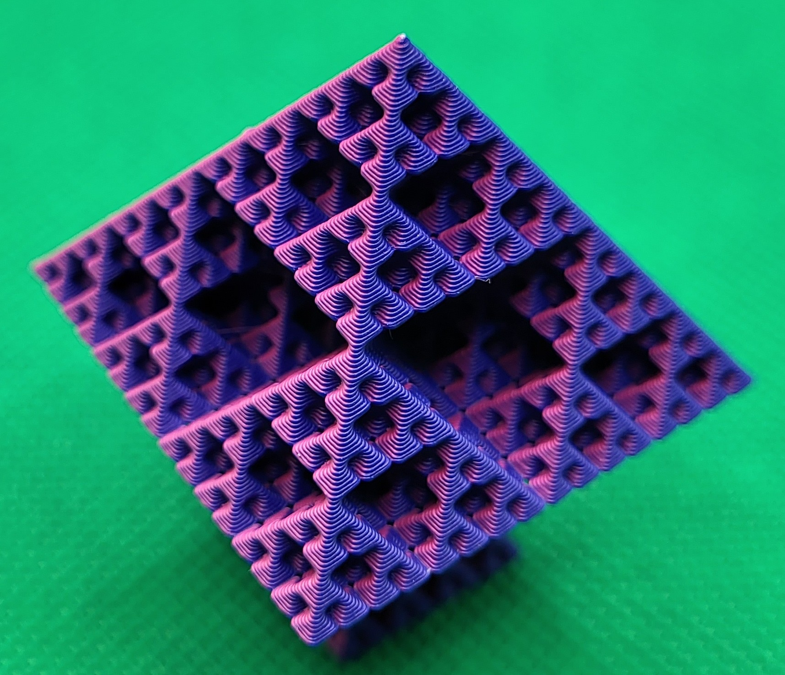

# 🚨 _One-Stop-Shop_ Klipper Configuration

## This branch contains my personal settings.

## Switch to a More Appropriate Branch

| Printer                     | Branch                                                                                    |
| --------------------------- | ----------------------------------------------------------------------------------------- |
| Sovol SV06                  | [master](https://github.com/bassamanator/Sovol-SV06-firmware/tree/master)                 |
| Sovol SV06 Skr-Mini-E3-V3.0 | [skr-mini-e3-v3](https://github.com/bassamanator/Sovol-SV06-firmware/tree/skr-mini-e3-v3) |
| Sovol SV06 Plus             | [sv06-plus](https://github.com/bassamanator/Sovol-SV06-firmware/tree/sv06-plus)           |
| All other printers          | [any-printer](https://github.com/bassamanator/Sovol-SV06-firmware/tree/any-printer)       |

# Speedrun

